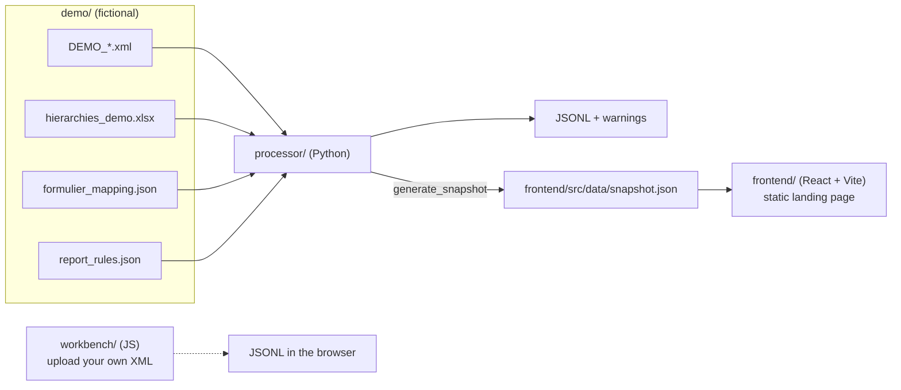
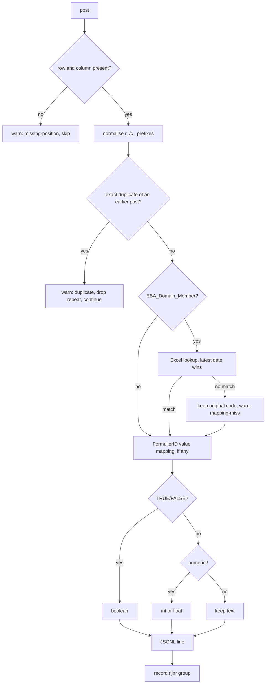

# Architecture

## Overview

Three deliverables share one repository. Only the Python processor defines the transformation behaviour; the other two consume or mirror it.

| Folder | Role | Source of truth for |
|---|---|---|
| `processor/` | The real transformation | Behaviour, output format, warnings |
| `frontend/` | The portfolio page | Presentation only |
| `workbench/` | An interactive converter for your own XML | Nothing; it mirrors the processor in JavaScript |
| `demo/` | Fictional inputs and expected outputs | Test fixtures and page data |

## Python processor

| Module | Responsibility |
|---|---|
| `xml_parser.py` | Reads `<rapportage>` metadata and each `<post>` using `expat`, keeping source line numbers. Accepts spelling variants of attribute names. Raises `ProcessingError` with a line number for malformed XML. |
| `hierarchy_mapper.py` | Loads the `Hierarchies` sheet with pandas. Keeps the latest-dated entry per Domain and Member. Parses `EBA_<Domain>_<Member>` codes. Lookups are case-sensitive. |
| `transformer.py` | Row and column normalisation, numeric and boolean conversion, and the per-value transformation with a step-by-step trace. |
| `rule_registry.py` | Generic rules are separate from FormulierID rules. Reads the report code and any value mappings for a FormulierID. |
| `validator.py` | Exact-duplicate detection and the `Issue` type. Findings are collected, never raised. |
| `jsonl_generator.py` | Deterministic, compact JSON with a fixed key order. |
| `pipeline.py` | Runs parse, transform, validate and write for one file, and returns lines, issues, per-post trace, `rijnr` groups and run statistics. |
| `cli.py` | `python -m processor.cli <xml...> [--out-dir DIR]` |
| `generate_snapshot.py` | Runs the processor on the demo files and writes the snapshot the page reads. |

### What happens to each `<post>`

## Snapshot: how the page uses the processor

The page does not run Python or call a server. Instead:

1. `python -m processor.generate_snapshot` runs the real processor on the demo files.
2. It writes `frontend/src/data/snapshot.json`: the four stages of the example record, the Excel rows shown, the duplicate and mapping-miss examples, the report grid, run statistics, and `rijnr` groups.
3. The page reads that file. Copy lives in `frontend/src/content/pageContent.js`; data access lives in `frontend/src/data/selectors.js`.
4. A processor test regenerates the snapshot in memory and **fails if the checked-in file differs**, so the page cannot drift from the processor.

This keeps the deployment a plain static site while the numbers shown are real processor output.

## Frontend

- **React + Vite**, one continuous scroll, no routing, no tabs, no upload.
- **One interaction**: *Run example transformation* reveals four stages (XML input, Excel mapping, business rule, JSONL output). The XML stage is visible beforehand so the page reads without clicking.
- **Motion**: a single fade-in per section and a staggered reveal in the interaction. Both are disabled under `prefers-reduced-motion`.
- **Content and rendering are separate**: text in `content/`, data access in `data/`, one component per page section in `components/`.
- **Static output**: `npm run build` produces `frontend/dist` with relative paths, so it can be hosted from any path.

## Workbench

An earlier interactive tool kept as a secondary deliverable: paste or upload an XML file, load a hierarchy, and inspect warnings and a per-record trace. Written in JavaScript and run entirely in the browser.

It **mirrors** the processor rather than sharing code, and differs in a few deliberate ways (see the comparison in [PROCESSING_RULES.md](PROCESSING_RULES.md)). If the two ever disagree, the processor is correct.

## Design decisions in brief

| Decision | Reason |
|---|---|
| Python is the source of truth | The original solution was Python; the demonstration should be a real, testable implementation |
| Snapshot instead of an API | A static site is simpler to host and cannot fail at run time; a test guards against drift |
| `expat` instead of a higher-level parser | Gives line numbers for warnings and clear malformed-XML errors |
| pandas for the workbook | Matches the original approach to Excel reference data |
| Compact JSON with fixed key order | Byte-for-byte comparison against expected files is possible |
| React + Vite | Component-level tests for the one interaction; static build |

More in [DECISIONS_AND_LIMITATIONS.md](DECISIONS_AND_LIMITATIONS.md).

## Non-goals

No real downstream reporting integration, no authentication, no client data, no upload flow on the landing page, and no attempt to reconstruct report rules that are not remembered.

## Extending it

| To add | Do this |
|---|---|
| A hierarchy entry | Add a row to the `Hierarchies` sheet (a newer date supersedes an older one) |
| A report identifier and code | Add it to `demo/formulier_mapping.json` |
| A report-specific value mapping | Add a `value_map` under the FormulierID in `demo/report_rules.json` |
| A new demo file | Add XML and an `expected_*.jsonl` to `demo/`, then add it to the parametrised golden-file test |
| A new finding type | Add an `Issue` constructor in `validator.py` and emit it from `pipeline.py` |

After any processor change, run `python -m processor.generate_snapshot` and the tests.
